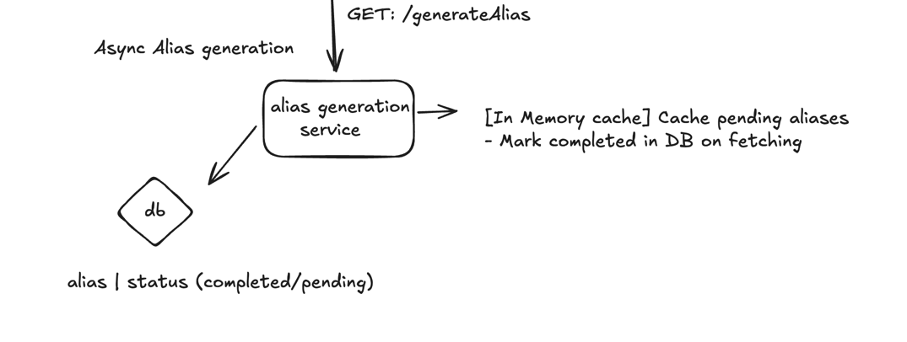
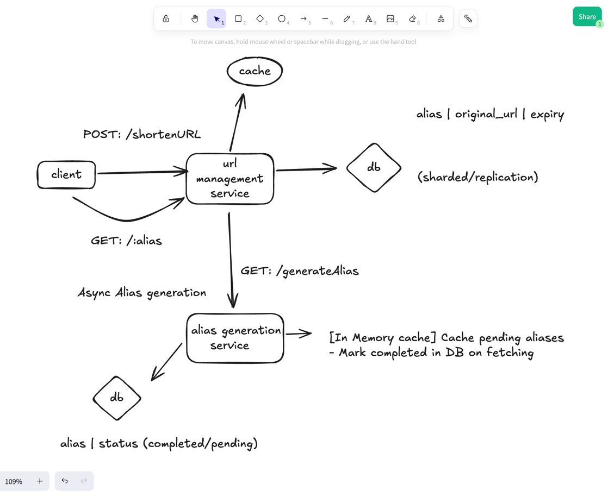
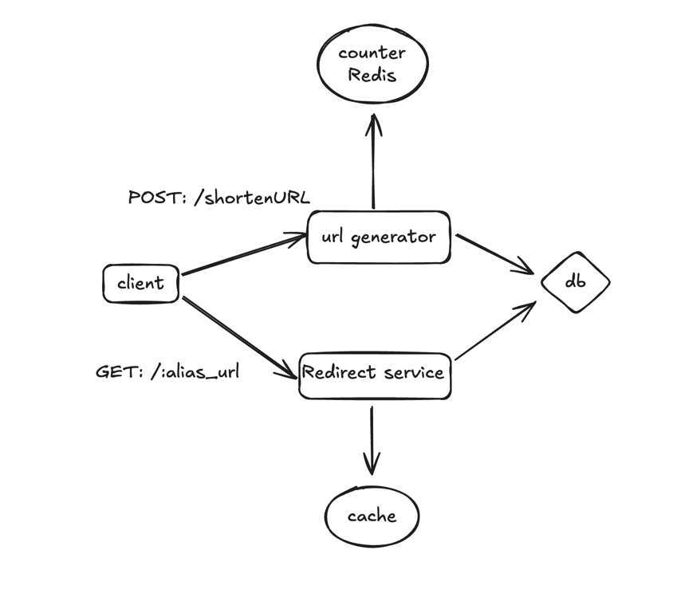

- Design a URL shortening service

## Requirements

### Functional Requirements:
1. Given a URL, our service should generate a shorter and unique alias of it. This is called a short link.
2. When users access a short link, our service should redirect them to the original link.
3. Users should optionally be able to pick a custom short link for their URL.
4. Links will expire after a standard default timespan. Users should be able to specify the
   expiration time.

### Non-Functional Requirements:
1. The system should be highly available. This is required because, if our service is down, all the URL redirections will start failing.
2. URL redirection should happen in real-time with minimal latency.
3. Shortened links should not be guessable (not predictable).

## API Design

### POST: /shortenURL(url, expiration_date, custom_alias)
- generate, store and return shortneded url
- generation:
  - if custom_alias available then geenrate for custom_alias
  - generate for random short alias
  - store and return the short url

### GET: ourdomain.com/{url}
- redirect to original url if present, else return error

## Data Model

### Relational
- URL -> original_url, alias_url, expiration_time

## Alias Generation Techniques

### Async Alias Generation
- Alias generation service generates bulk aliases in async (can be configured to generate either all possible aliases for 6 char or bulk generate them)
- Stores states of aliases - pending (unused) / completed (used)

#### Further optimize alias generation
- In Memory cache: Batch cache (eg: 1000 aliases) aliases from DB and mark them completed (cache in each app server)
- This way bulk aliases are readily generated beforehand 

### Sync Alias Generation

#### Good Method
- Hash the original url (MD5 or SHA256) to unique alias
- Encode the generated hash with base62 (why not base64? '/' should not be there in alias URL)
- Take the first 6 chars from the base62 encoded value
- If conflicts/duplicate -> Then repeat

##### Problems/Bottlenecks?
- Conflicts and Duplicates
- Need DB operation to check if alias is taken

##### How to minimise duplicates?
- Take longer alias length from encoded value -> Bad user experience
- Append the encoded value with 
  - Unique counter for the day -> base62 encode
  - Date/Time counter (Epoch value) -> base62 encode

#### Great Method
- Maintain a unique counter for each alias - can use Redis (provides atomicity, concurrency out of the box)
- Encode the counter with base62 -> ensure shorter length
- Use as alias - as it'll always be unique

##### Problems/Bottlenecks?
- Concurrency bottleneck on generating the next counter (incrementing counter)
- Durabality of counter -> Periodically store counter to persistent store?

##### How to confront concurrency bottleneck
- Counter Batching: Batch Increment the counter and serve the batch from In Memory cache of the application
- Even if a server dies the counters would be lost -> Should be okay
- Cache need to handle concurrent operations on counter batching -> Redis provides

## High Level Design

### Async Alias Generation

### Sync Alias Generation

### Expiry
- Use cron job / scheduler -> Schedule expiry jobs to delete / revert the used aliases
