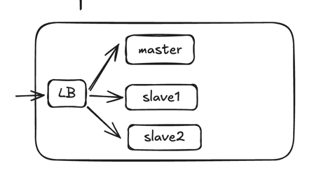

- Design a URL shortening service

## Requirements

### Functional Requirements:
1. Given a URL, our service should generate a shorter and unique alias of it. This is called a short link.
2. When users access a short link, our service should redirect them to the original link.
3. Users should optionally be able to pick a custom short link for their URL.
4. Links will expire after a standard default timespan. Users should be able to specify the
   expiration time.

### Non-Functional Requirements:
1. The system should be highly available. This is required because, if our service is down, all the URL redirections will start failing.
2. URL redirection should happen in real-time with minimal latency.
3. Shortened links should not be guessable (not predictable).

## API Design

### POST: /shortenURL(url, expiration_date, custom_alias)
- generate, store and return shortneded url
- generation:
  - if custom_alias available then geenrate for custom_alias
  - generate for random short alias
  - store and return the short url

### GET: ourdomain.com/{url}
- redirect to original url if present, else return error

## Data Model

### Relational
- URL -> original_url, alias_url, expiration_time

### High Level Design

## Bottlenecks

### Expiry
- Delay in expiry due to async operation

### Scalability
- Read can be made efficient using caching
